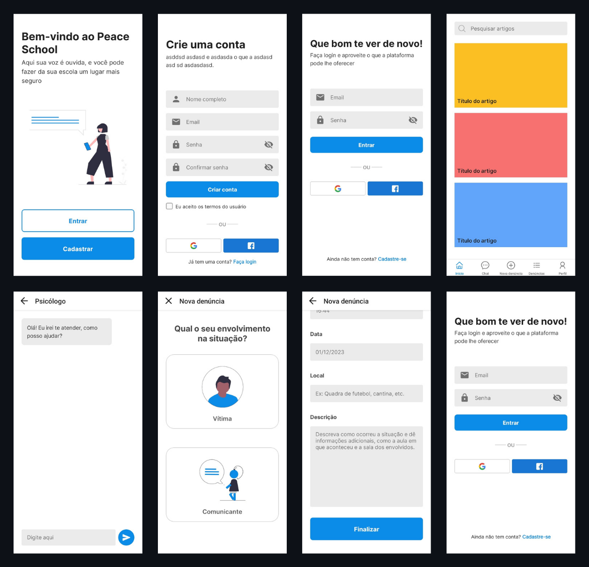

# Peace School

## O que é Peace School

O Peace School foi um projeto que nasceu na **Escola Sesi Djalma Pessoa (Salvador-BA)**, e que teve como objetivo propor uma solução para um problema sério e que várias instituições de ensino enfretam, a importunação sexual.

Além dela, ainda é possível comunicar outros tipos de abuso no aplicativo, através da sua aba de denúncias.

O aplicativo foi criado para servir como canal de denúncias onde alunos poderiam comunicar situações de abuso ocorridas na sua instituição de ensino.

Por fim, os alunos também teriam a opção de conversar com psicólogos através do aplicativo, caso tivessem passado por alguma dessas situações.

## Tecnologias usadas no projeto

- [React](https://react.dev/) 
- [React Native](https://reactnative.dev/) 
- [React-Navigation](https://reactnavigation.org/)
- [React Native Scalable Image](https://github.com/ihor/react-native-scalable-image)
- [Native Base](https://nativebase.io/)
- [Expo](https://expo.dev/)
- [Babel](https://babeljs.io/)
- [Firebase](https://firebase.google.com/)

## Gostou? Tem uma sugestão?
**Me conta o que achou!** Seu feedback é muito importante para o meu crescimento e a melhora deste projeto.

Pode falar comigo por:
- Email: bernardoeulersantos@gmail.com
- LinkedIn: [in/bernardoeuler](https://www.linkedin.com/in/bernardoeuler)
- Discord: [bernardoeuler_](https://discord.com/users/367741578808393729)

## Obrigado!

Obrigado por ter vindo até aqui. Que tal dar uma olhada em outros projetos interessantes como este?

- [LIMPAX](https://github.com/bernardoeuler/limpax) - Aplicativo que dá voz à população
- [BINARY TO DECIMAL](https://github.com/bernardoeuler/binary-to-decimal-converter) - Conversor de binário para decimal
- [TO-DO LIST APP](https://github.com/bernardoeuler/todo-app) - Aplicativo de lista de tarefas